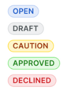
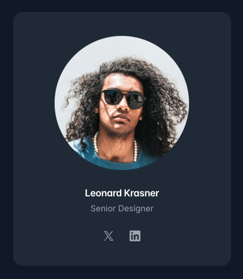
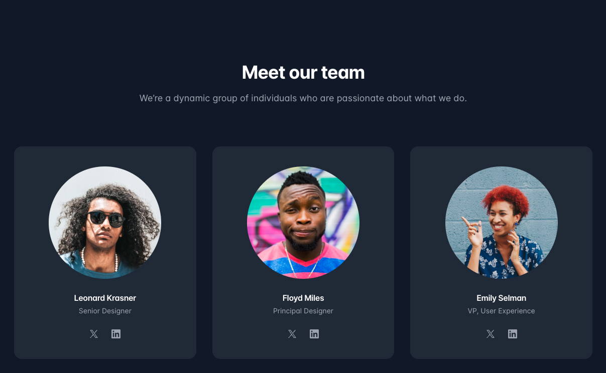

# The Remix `root.tsx` file

:::info[Understanding the `root.tsx` file]
The `root.tsx` file in a Remix project serves as the entry point for your application's user interface. It renders the initial HTML structure of your project, and provides the foundation for the rest of your application's components and pages to be displayed.

Think of it as the starting point where all the UI elements come together and get rendered on the screen.
:::

This tutorial will guide you through updating the user interface (UI) in the `root.tsx` file of a Remix project. We'll start with the basics, so don't worry if you're not familiar with these technologies yet. Let's dive in!

## Getting Started

Before we begin, ensure you have `npm` (Node Package Manager) installed on your system as it's essential for running our project server and managing our dependencies.

### 1. Start the Server

First, we need to start our development server. Open your terminal, navigate to your project directory, and run:

```bash title="Running the server with npm"
npm run dev
```

This command starts a local development server. Once 's up and running, you can view your project in a web browser by going to `http://localhost:3000`.

### 2. Update Text on the Screen

To change the existing text, locate the `<h1>` tag inside the `App` function in your `root.tsx` file:

```tsx title="app/root.tsx" showLineNumbers
<h1 className="text-mega">Welcome to Epic News!</h1>
```

Change `"Welcome to Epic News!"` to any message you like, such as `"Your New Journey Begins!"`.

```tsx title="app/root.tsx" showLineNumbers
<h1 className="text-mega">Your Journey Begins!</h1>
```

Save the file and your browser should automatically refresh, displaying the new message.

### 3. Add a New Element to the Page

Let's add a new paragraph (`<p>`) element below the `<h1>` tag. This will demonstrate how to insert new content into your page.

```tsx title="app/root.tsx" showLineNumbers
<main className="grid h-full place-items-center">
  <h1 className="text-mega">Your Journey Begins!</h1>
  <p>Welcome to Epic News, where the latest developments in tech are found.</p>
</main>
```

### 4. Style the New Element Using Tailwind Classes

To style the paragraph, we'll use TailwindCSS, a utility-first CSS framework. If you're not familiar with Tailwind, it allows you to style elements by adding class names directly in your HTML (or JSX in this case).

```tsx title="app/root.tsx" showLineNumbers
<p className="text-base text-gray-600">
  Welcome to Epic News, where the latest developments in tech are found.
</p>
```

### 5. Make the New Element Responsive

Tailwind makes creating responsive designs straightforward. To demonstrate, let's make the font size of our paragraph larger on medium (`md`) and large (`lg`) screens.

```tsx title="app/root.tsx" showLineNumbers
<p className="text-base text-gray-600 md:text-lg lg:text-xl">
  Welcome to Epic News, where the latest developments in tech are found.
</p>
```

In Tailwind, `md:` and `lg:` are responsive prefixes that apply their styles at specific breakpoints, allowing for mobile-first designs.

Try making your browser window wider and narrower. Notice how the text size changes according to the width of your viewport.

::::warning[Challenge]

# Code Challenges

Now that you've seen how to update the UI, try these challenges to practice your new skills:

1. **Change the Background Color**: Update the background color of the `<div>` that wraps the `<main>` tag.
2. **Add a Button**: Insert a button below the paragraph with the text "Learn More". Style it with Tailwind to look appealing.
3. **Make the Button Responsive**: Adjust the size and padding of the button for small and large screens.

---

:::tip

- Remember, start with **mobile-first** designs in mind and then scale up to larger screens.
- Use the [Tailwind CSS docs](https://tailwindcss.com/docs) to learn how to use their classes. Below are a few key guides to get you started with the challenges above:
  - https://tailwindcss.com/docs/background-color
  - https://tailwindcss.com/docs/text-color
  - https://tailwindcss.com/docs/padding
  - https://tailwindcss.com/docs/border-radius
  - https://tailwindcss.com/docs/box-shadow

:::

## Extra Credit 🚀

### 1. Create a series of UI 'Pills' - small elements that show the status of something like this:



​**Tailwind focus**: text colour, background colour, padding, border colour, border radius

### 2. Create a card component representing a team member that has:

- An image at the top (use placeholders if needed).
- A title and a short description.
- Buttons for their Twitter/X and LinkedIn profiles.
- Ensure the card is responsive and maintains its aspect ratio.

**Tailwind Focus**: image positioning, object cover, padding, margins, border radius, background colour



### 3. Use your card component to create the 'Meet our team' section below:



::::

<details>
  <summary>
    ## Solutions
  </summary>

  <div>
    There are actually lots of ways you could complete these challenges. Below are a few.

    ---

    ### 1. Change the Background Color

    ```tsx title="app/root.tsx" showLineNumbers
    <div className="flex h-screen flex-col justify-between bg-blue-100">
    ```

    ### 2. Add a Button

    ```tsx title="app/root.tsx" showLineNumbers
    <button className="px-4 py-2 bg-blue-500 text-white rounded-md">
      Learn More
    </button>
    ```

    ### 3. Make the Button Responsive

    ```tsx title="app/root.tsx" showLineNumbers
    <button className="px-4 py-2 md:px-6 md:py-3 lg:px-8 lg:py-4 bg-blue-500 text-white rounded-md">
      Learn More
    </button>
    ```

  </div>

</details>

## Congratulations! 🥳

You've just updated your first Remix UI, added elements, styled them, and made them responsive with Tailwind.

Keep experimenting with different elements and styles to further enhance your page.
