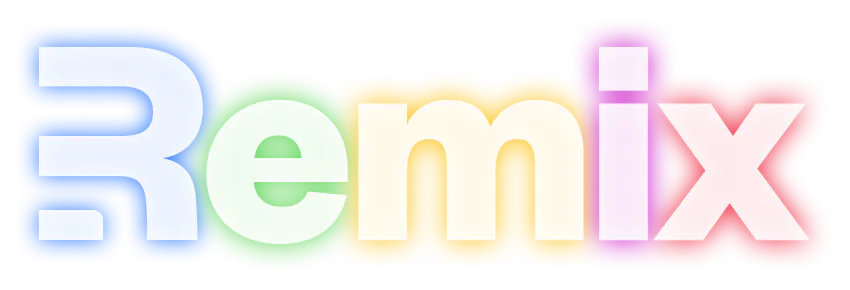

Since its launch, Remix has become a popular framework amongst React developers. Below are a list of resources to help you get started.

## Web resources

- Remix [docs](https://remix.run/docs/en/main)
- [Getting started](https://remix.run/docs/en/main/start/tutorial) tutorial
- The official Remix [resources](https://remix.run/resources?category=all) page

## Free video courses

- [Up and Running with Remix](https://egghead.io/courses/up-and-running-with-remix-b82b6bb6) - Kent C. Dodds
- [Build as Realtime Chat App with Remix and Supabase](https://egghead.io/courses/build-a-realtime-chat-app-with-remix-and-supabase-d36e2618) by Jon Meyers

## Further reading

- [Full Stack Web Development with Remix](https://www.packtpub.com/product/full-stack-web-development-with-remix/9781801075299) by Andre Landgraf
